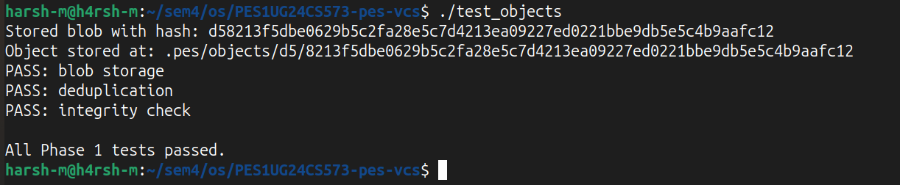
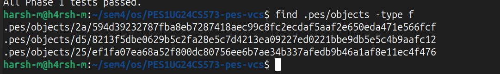
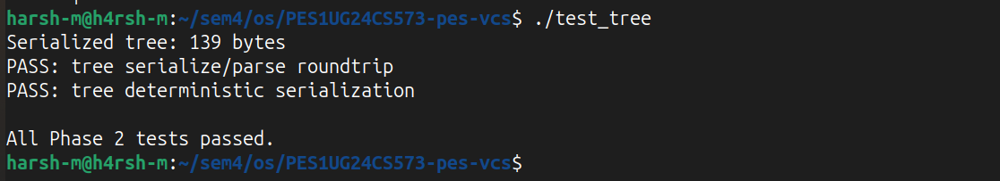
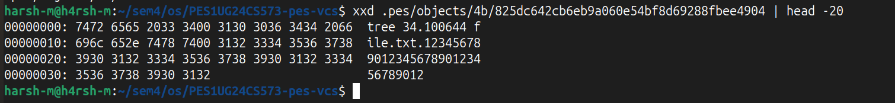
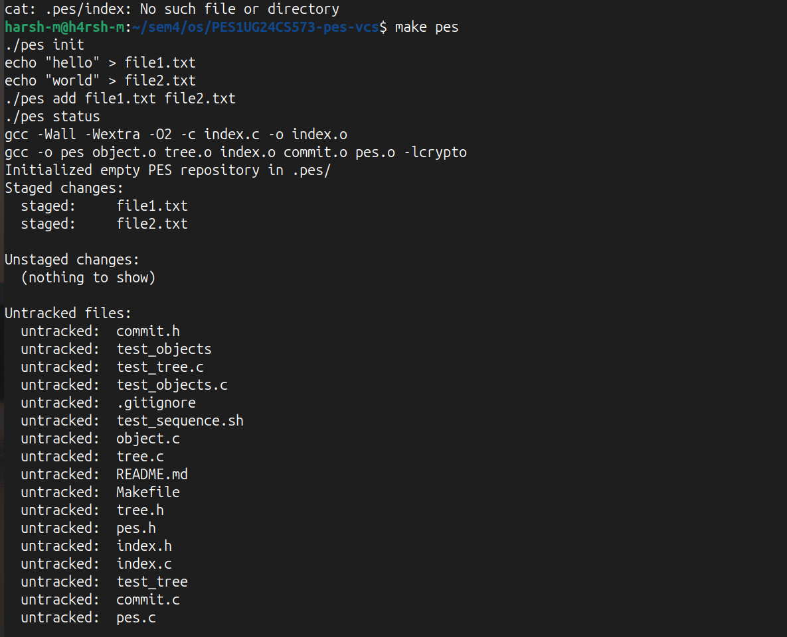
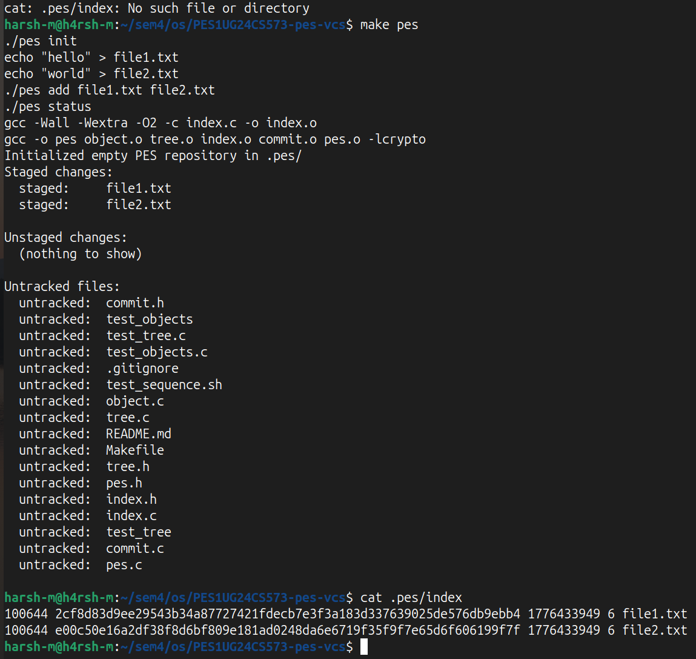
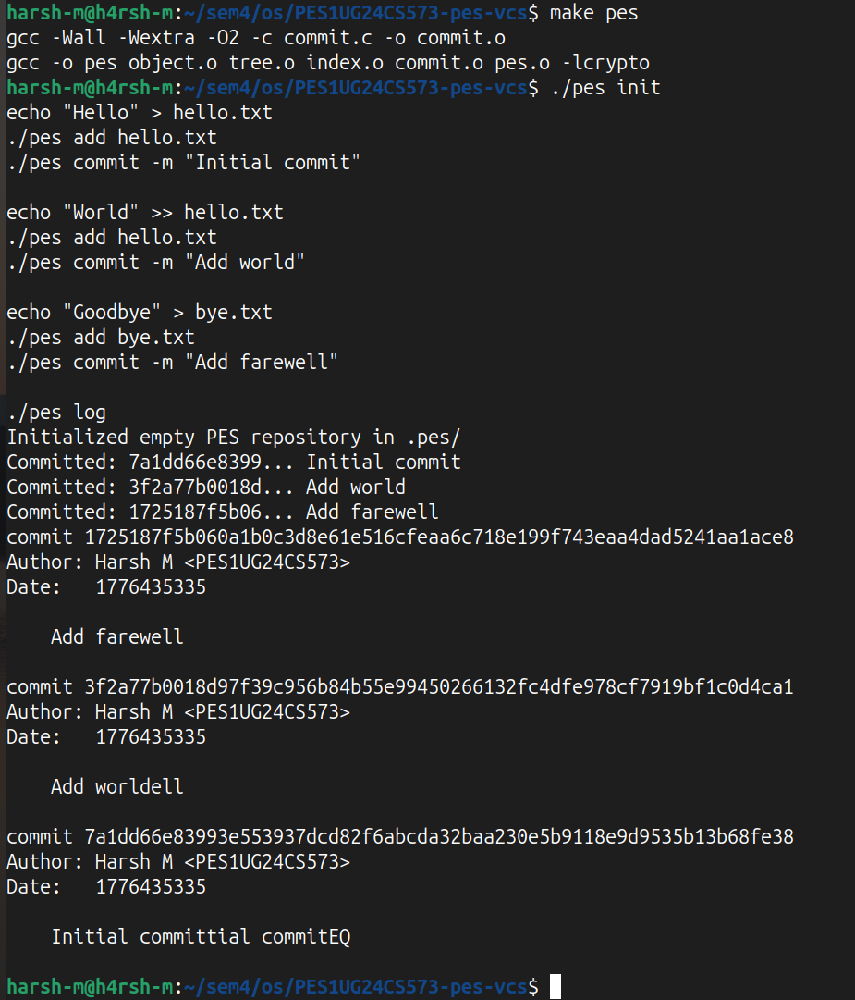
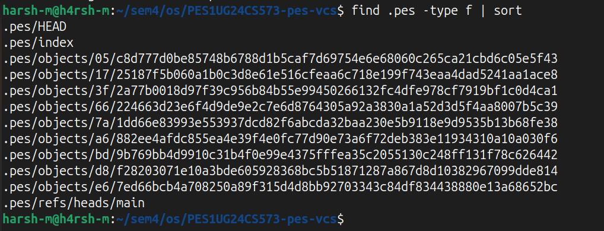
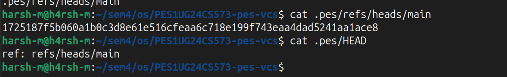
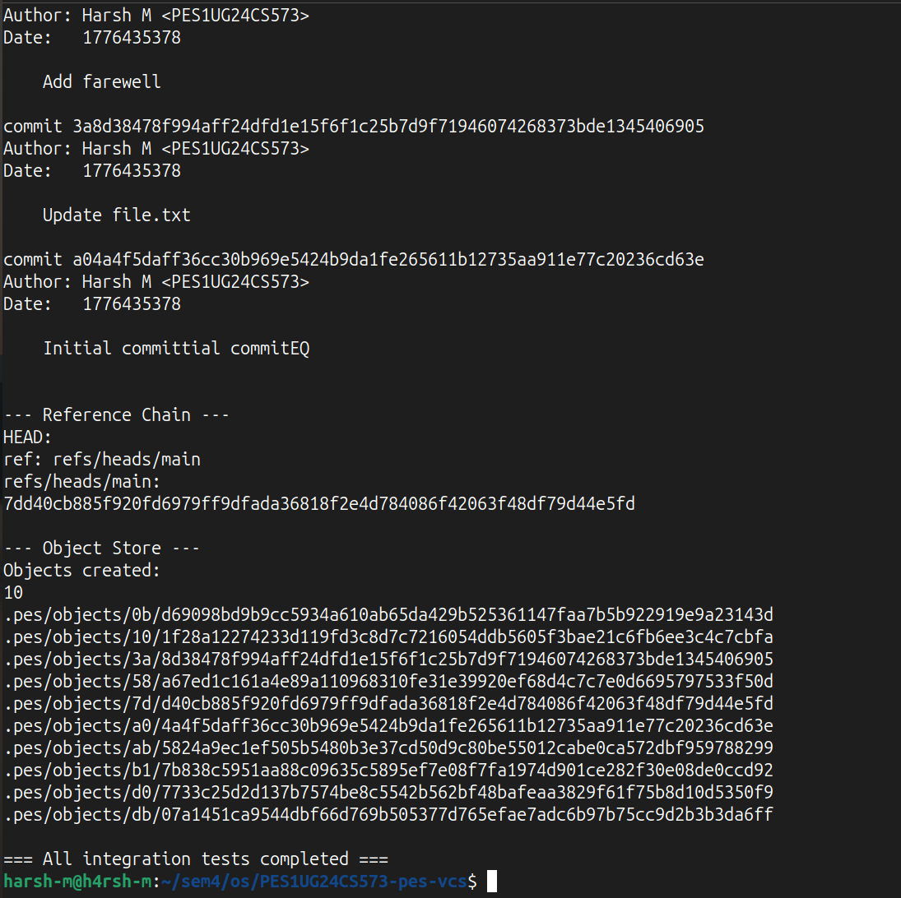

# PES-VCS — OS Lab Final Report

**Name:** Harsh M
**SRN:** PES1UG24CS573
**Course:** Operating Systems - B.Tech CSE

---

## 1. Screenshots

### Phase 1: Object Storage Foundation
**1A: `./test_objects` output showing all tests passing**

**1B: `find .pes/objects -type f` showing sharded directory structure**

### Phase 2: Tree Objects
**2A: `./test_tree` output showing all tests passing**

**2B: `xxd` of a raw tree object**

### Phase 3: The Index (Staging Area)
**3A: `pes init` → `pes add` → `pes status` sequence**

**3B: `cat .pes/index` showing the text-format index**

### Phase 4: Commits and History
**4A: `pes log` output with three commits**

**4B: `find .pes -type f | sort` showing object store growth**

**4C: `cat .pes/refs/heads/main` and `cat .pes/HEAD`**

### Final Integration Test
**Full integration test (`make test-integration`)**

---

## 2. Analysis Questions

### Branching and Checkout

**Q5.1: A branch in Git is just a file in `.git/refs/heads/` containing a commit hash... how would you implement `pes checkout <branch>` — what files need to change in `.pes/`, and what must happen to the working directory? What makes this operation complex?**

For implementing `pes checkout <branch>`, the system first needs to read the commit hash stored in `.pes/refs/heads/<branch>`. Then we update the `.pes/HEAD` file to say `ref: refs/heads/<branch>`. After this, the working directory has to be cleared of currently tracked files and repopulated by recursively traversing the new target commit's root tree object to extract the blobs. The main complexity here is preserving untracked files and making sure we don't accidentally overwrite unstaged modifications. This requires a three-way comparison between the working directory, the index, and the target tree before doing anything.

**Q5.2: When switching branches... If the user has uncommitted changes to a tracked file, and that file differs between branches, checkout must refuse. Describe how you would detect this "dirty working directory" conflict using only the index and the object store.**

To detect this conflict without having to re-hash all the working directory files, we can just use the index metadata. We compare the `mtime` and `size` saved in the index with the actual `stat()` output of the working directory files. If they don't match, the file was modified. If it is modified, we then check the blob hash in the index against the blob hash for that same path in the target branch's tree. If the target tree expects a different hash than what's in the index, then there is a conflict and checkout must be aborted to prevent data loss.

**Q5.3: "Detached HEAD" means HEAD contains a commit hash directly instead of a branch reference. What happens if you make commits in this state? How could a user recover those commits?**

If you make commits in a detached HEAD state, the new commit objects are created and HEAD gets updated to point directly to them, but no actual branch reference file (like in `refs/heads/`) is updated. If you checkout a different branch later, those new commits become dangling because there is no named reference pointing to them. To recover them, a user would have to check the reflog (which tracks recent HEAD movements) or run something like `git fsck` to find the dangling commit objects and manually create a branch for those hashes.

---

### Garbage Collection and Space Reclamation

**Q6.1: Over time, the object store accumulates unreachable objects... Describe an algorithm to find and delete these objects. What data structure would you use to track "reachable" hashes efficiently? For a repository with 100,000 commits and 50 branches, estimate how many objects you'd need to visit.**

We can use a Mark-and-Sweep algorithm. For the mark phase, we traverse all references in `.pes/refs/` and `.pes/HEAD` and keep track of reachable hashes using a hash set. For each commit, we mark it as reachable, then go to its tree, mark that, and traverse all its blob entries to mark them too. We also follow the parent pointers to mark the whole history. For the sweep phase, we just iterate through every file in `.pes/objects/` and delete anything that isn't in our reachable set. For 100,000 commits, it won't cause an exponential explosion because identical trees or blobs are only visited once if we track them properly.

**Q6.2: Why is it dangerous to run garbage collection concurrently with a commit operation? Describe a race condition where GC could delete an object that a concurrent commit is about to reference. How does Git's real GC avoid this?**

Running GC during a commit creates a race condition. For example, if the user runs `pes add file.c`, the blob gets written to `.pes/objects/`. But if GC starts before the user runs `pes commit`, GC will see that the blob is only in the index and no commit actually references it yet, so it flags it as unreachable and deletes it. The commit operation will still succeed, but the tree will end up pointing to a missing blob, which corrupts the repo. Real Git handles this by using a grace period based on the object's `mtime`. Objects newer than the grace period (like 14 days) are spared, which protects in-flight operations.